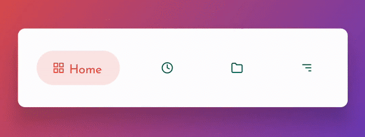

# BubbleTabBar

BubbleTabBar is bottom navigation bar with customizable bubble like tabs

[](https://androidweekly.net/issues/issue-474)
[](https://devlibrary.withgoogle.com/products/android/repos/akshay2211-BubbleTabBar)
[](https://app.codacy.com/gh/akshay2211/BubbleTabBar?utm_source=github.com&utm_medium=referral&utm_content=akshay2211/BubbleTabBar&utm_campaign=Badge_Grade)
[](https://www.appbrain.com/stats/libraries/details/bubbletabbar/bubbletabbar)
[](https://android-arsenal.com/details/1/7841)
[](https://android.libhunt.com/bubbletabbar-alternatives)
[](https://android-arsenal.com/api?level=21)
[](https://devlibrary.withgoogle.com/products/android/repos/akshay2211-BubbleTabBar)



## Usage
 
```xml
    <com.example.animatedbottombar.bubbleTabBarView.BubbleTabBar
               android:id="@+id/bubbleTabBar"
               android:layout_width="match_parent"
               android:layout_height="wrap_content"
               android:background="#FFF"
               android:elevation="16dp"
               android:padding="7dp"
               app:bubbletab_menuResource="@menu/list"
               app:bubbletab_custom_font="@font/opensans"
               app:bubbletab_disabled_icon_color="@color/colorPrimaryDark"
               app:bubbletab_horizontal_padding="20dp"
               app:bubbletab_icon_size="20dp"
               app:bubbletab_title_size="16sp"
               app:bubbletab_icon_padding="5sp"
               app:bubbletab_vertical_padding="10dp"
               app:bubbletab_tab_corner_radius="25dp">
       </com.example.animatedbottombar.bubbleTabBarView.BubbleTabBar>
```
or just use
```xml
    <com.example.animatedbottombar.bubbleTabBarView.BubbleTabBar
               android:id="@+id/bubbleTabBar"
               android:layout_width="match_parent"
               android:layout_height="wrap_content"
               android:padding="7dp"
               app:bubbletab_menuResource="@menu/list">
       </com.example.animatedbottombar.bubbleTabBarView.BubbleTabBar>
```
Inflate menu list
```xml
<menu xmlns:android="http://schemas.android.com/apk/res/android">
    <item
        android:id="@+id/home"
        android:icon="@drawable/baseline_home_24"
        android:title="Home"
        android:checked="true"
        android:color="@color/white"/>

    <item
        android:id="@+id/search"
        android:icon="@drawable/baseline_search_24"
        android:title="Search"
        android:color="@color/white"/>

    <item
        android:id="@+id/profile"
        android:icon="@drawable/baseline_supervised_user_circle_24"
        android:title="Profile"
        android:color="@color/white"/>

</menu>
            
```

Add onclick listener 

```kotlin
   bubbleTabBar.addBubbLeListener(object : OnBubbleClickListener{
               override fun onBubbleClick(id: Int) {
                   
               }
           })
```
### Connect with components like [ViewPager](https://github.com/akshay2211/BubbleTabBar/blob/master/README.md#setup-viewpager-to-bubbletabbar), [ViewPager2](https://github.com/akshay2211/BubbleTabBar#setup-viewpager2-to-bubbletabbar) and [NavController](https://github.com/akshay2211/BubbleTabBar#setup-navcontroller-to-bubbletabbar)
#### Setup ViewPager to BubbleTabBar

```kotlin

    viewPager.addOnPageChangeListener(object : ViewPager.OnPageChangeListener {
            override fun onPageScrolled(
                position: Int,
                positionOffset: Float,
                positionOffsetPixels: Int
            ) {

            }

            override fun onPageSelected(position: Int) {
                bubbleTabBar.setSelected(position, false)
            }

            override fun onPageScrollStateChanged(state: Int) {
            }
        })
   
```

#### Setup ViewPager2 to BubbleTabBar

```kotlin

    viewPager2.registerOnPageChangeCallback(object : ViewPager2.OnPageChangeCallback() {
                               override fun onPageSelected(position: Int) {
                                   super.onPageSelected(position)
                                   bubbleTabBar.setSelected(position)
                               }
                           })

```

#### Setup NavController to BubbleTabBar

*onNavDestinationSelected* can be found in [here](https://github.com/akshay2211/BubbleTabBar/blob/cad8bdc3b634410c4d76c99853016e955f9fac70/app/src/main/java/com/fxn/bubbletabbarapp/utils/Helper.kt#L36)

```kotlin

    bubbleTabBar.addBubbleListener { id ->
                bubbleTabBar.onNavDestinationSelected(id, navController)
            }
    navController.addOnDestinationChangedListener { _, destination, _ ->
                setSelectedWithId(destination.id, false)
            }
    

```